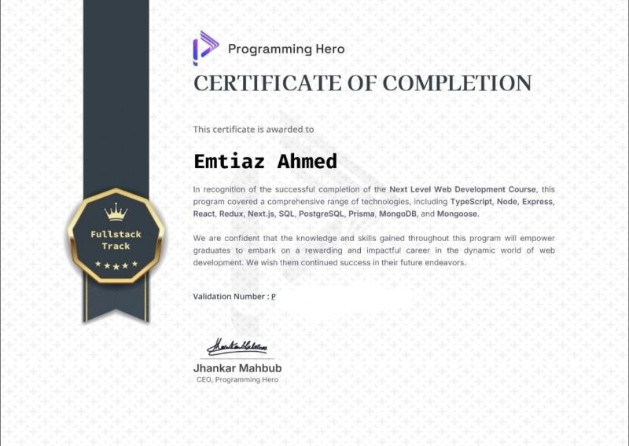
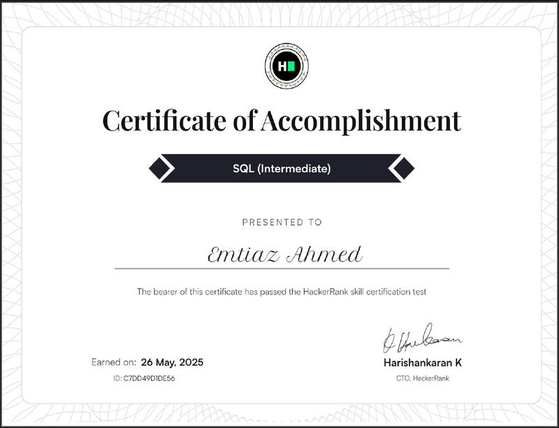
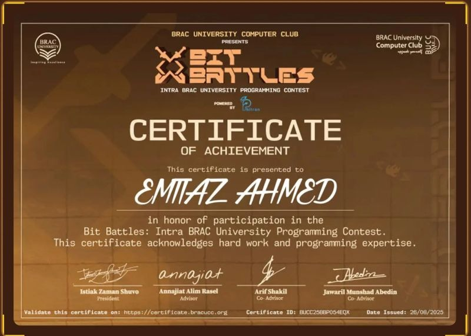
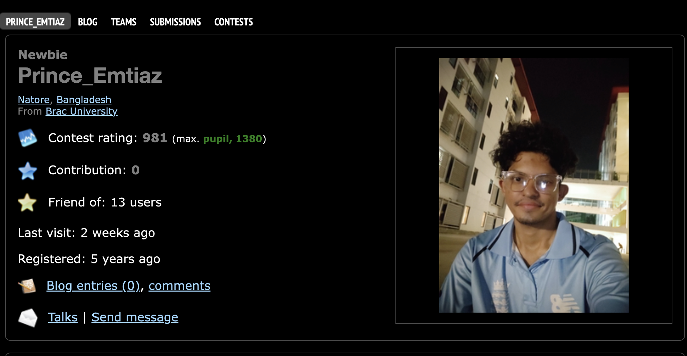
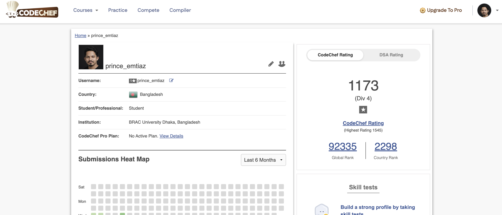

<div align="center">


<p align="center">
  
</p>

<h3>Software Engineer | React & Next.js Specialist | Problem Solver</h3>

<p>
  Building scalable web applications with modern technologies.<br>
  Merging clean code with efficient algorithms.
</p>

<p align="center">
  <a href="https://github.com/Emtiaz-ahmed-13?tab=followers">
    
  </a>
  <a href="https://github.com/Emtiaz-ahmed-13">
    
  </a>
  <a href="https://github.com/Emtiaz-ahmed-13?tab=repositories">
    
  </a>
</p>

</div>

# Hi 👋, I'm Emtiaz Ahmed

### Full Stack Developer | MERN & Next.js | TypeScript | Problem Solver

I'm a Computer Science student and Full Stack Developer passionate about building scalable web applications, modern user experiences, and production-ready backend systems.

I specialize in developing AI-powered platforms, SaaS products, marketplaces, and real-time applications using modern web technologies.

🚀 Currently building production-grade full-stack applications with Next.js, Node.js, Express, NestJS, PostgreSQL, MongoDB, Prisma, Docker, and AWS.

---

## 🌐 Connect With Me

<p align="left">
<a href="https://linkedin.com/in/emtiaz-ahmed-13"></a>
<a href="mailto:emtiaz2060@gmail.com"></a>
<a href="https://github.com/Emtiaz-ahmed-13"></a>
<a href="https://leetcode.com/u/emtiaz"></a>
<a href="https://codeforces.com/profile/Prince_Emtiaz"></a>
</p>

---

# 👨‍💻 About Me

I'm a **passionate Full Stack Developer** with expertise in building scalable, production-ready web applications using modern technologies. With a strong foundation in **competitive programming** and **problem-solving**, I bring algorithmic thinking to real-world software development challenges.

#### 💼 Professional Highlights

- 🎯 **2+ years** of hands-on experience in full-stack development
- 🏗️ Built **5+ production-grade applications** serving real users
- 🚀 Specialized in **Next.js, React, Node.js, TypeScript, and PostgreSQL**
- 🤖 Integrated **AI/ML features** (Gemini AI, Groq AI) into web applications
- 💳 Implemented **payment systems** (Stripe) and **real-time features** (Socket.IO)
- 📊 Strong background in **Data Structures & Algorithms** (500+ DSA problems solved)

#### 🎓 What I Do

- 🔭 Currently working on **Full Stack Web Development** with focus on scalable architectures
- 🌱 Learning **Advanced System Design, Cloud Architecture & DevOps**
- 👯 Open to collaborate on **Open Source Projects** and **Innovative Startups**
- 💬 Ask me about **React, Next.js, Node.js, TypeScript, Prisma, and Competitive Programming**
- ⚡ Fun fact: **I can center a div in 3 different ways... and I know when to use each!**

#### 🎯 Career Goals

Seeking opportunities as a **Software Engineer** where I can leverage my full-stack expertise to build impactful products, contribute to innovative teams, and continue growing as a developer.

---

# 🎓 Education

<div align="left">

<table>
<tr>
<td width="100">

</td>
<td>

**Bachelor of Science in Computer Science**  
**[BRAC University](https://www.bracu.ac.bd/)** | Dhaka, Bangladesh  
📅 **2022 - Present** (Expected Graduation: 2026)

**Relevant Coursework:**

- Data Structures & Algorithms
- Database Management Systems
- Software Engineering
- Web Technologies
- Object-Oriented Programming

</td>
</tr>
</table>

</div>

---

# 🛠 Tech Stack

### Languages

<p>

</p>

### Frontend

<p>

</p>

- shadcn/ui
- Radix UI
- React Hook Form
- Zod
- TanStack Query
- Framer Motion

### Backend

<p>

</p>

- REST API
- JWT Authentication
- Refresh Token
- RBAC
- Better Auth
- NextAuth

### Database

<p>

</p>

- Prisma ORM
- Mongoose

### Cloud & DevOps

<p>

</p>

- Docker Compose
- GitHub Actions
- Vercel
- Render

### Other Technologies

- Stripe
- Socket.IO
- ImageKit
- Google Gemini AI
- Groq AI
- Swagger
- Vitest
- Playwright

<details>
<summary><b>💡 Skills Proficiency</b></summary>
<br>

**Frontend Development**

```
React.js          ██████████████░░░░░░ 70%
Next.js           ██████████████░░░░░░ 70%
TypeScript        ██████████████░░░░░░ 70%
Tailwind CSS      ██████████░░░░░░░░░░ 50%
```

**Backend Development**

```
Node.js           ███████████████████░ 90%
Express.js        ███████████████████░ 90%
PostgreSQL        █████████████████░░░ 80%
Prisma ORM        ██████████████████░░ 85%
```

**Tools & Technologies**

```
Git & GitHub      ████████████████████ 95%
Docker            ████████████░░░░░░░░ 60%
Vercel/Netlify    ███████████████████░ 90%
Socket.io         ██████████████████░░ 85%
```

**Problem Solving**

```
Data Structures   ███████████████████░ 90%
Algorithms        ██████████████████░░ 85%
System Design     ███████████████░░░░░ 70%
```

</details>

---

## 💡 Core Skills

- Full Stack Development
- Responsive UI Design
- Authentication & Authorization
- REST API Development
- Database Design
- Role-Based Access Control
- Payment Integration
- Real-time Applications
- AI Integration
- Docker Deployment
- CI/CD
- Performance Optimization

---

# 📜 Certifications

<div align="center">
  <table>
    <tr>
      <td align="center" width="45%">
        
        <br><br>
        <h3>Programming Hero</h3>
        <p>Complete Web Development (Level 1 & 2)</p>
      </td>
      <td align="center" width="45%">
        
        <br><br>
        <h3>HackerRank</h3>
        <p>SQL (Intermediate)</p>
      </td>
    </tr>
    <tr>
      <td align="center" width="45%" colspan="2">
        
        <br><br>
        <h3>BRAC University</h3>
        <p>Programming Contest</p>
      </td>
    </tr>
  </table>
</div>

---

# 🏆 Competitive Programming

<div align="center">
  <table>
    <tr>
      <td align="center" width="33%">
        <a href="https://leetcode.com/u/emtiaz">
          
        </a>
        <br><br>
        <h3>LeetCode</h3>
        <p>✅ 701+ Problems Solved</p>
        <p>Data Structures & Algorithms, SQL, Dynamic Programming, Graph, Trees, Greedy, Binary Search</p>
      </td>
      <td align="center" width="33%">
        <a href="https://codeforces.com/profile/Prince_Emtiaz">
          
        </a>
        <br><br>
        <h3>Codeforces</h3>
        <p>Max Rating: **1380**</p>
        <p>340+ Problems Solved</p>
      </td>
      <td align="center" width="33%">
        <a href="https://www.codechef.com/users/your_username">
          
        </a>
        <br><br>
        <h3>CodeChef</h3>
        <p>⭐ 2 Star</p>
        <p>150+ Problems Solved</p>
      </td>
    </tr>
  </table>
</div>

---

## 💻 LeetCode Stats

<div align="center">
  <br>
  
  <br><br>
</div>

---

### 🏆 GitHub Achievements

<div align="center">
  <br>
  
  <br><br>
</div>

---

### 📊 GitHub Analytics

<div align="center">
  <br>
  
  &nbsp;&nbsp;&nbsp;&nbsp;
  
  <br><br>
  
  <br><br>
</div>

## 📈 Contribution Graph

<div align="center">
  <br>
  
  <br><br>
</div>

## 🏆 GitHub Trophies

<div align="center">
  <br>
  
  <br><br>
</div>

---

# 🚀 Featured Projects

<table>

<tr>
<td width="50%">

### 🚀 SkillSync

Professional AI-powered Freelance Marketplace.

**Highlights**

- AI Project Brief Analyzer
- Milestone Escrow Payments
- Stripe Integration
- GitHub OAuth
- NextAuth Authentication
- Real-time Messaging
- Kanban Task Board
- Admin Dashboard

**Tech**

Next.js • TypeScript • Node.js • Express • MongoDB • Stripe • Socket.IO • Groq AI

**Links**

🔗 [Live Demo](https://skillsync-client.vercel.app/)

💻 [Client](https://github.com/Emtiaz-ahmed-13/skillsync/tree/main/skillsync_client)

⚙️ [Server](https://github.com/Emtiaz-ahmed-13/skillsync)

</td>

<td width="50%">

### 💼 CareerFlow

AI-powered Job Application Tracker.

**Highlights**

- Resume Vault
- ATS Resume Analyzer
- AI Cover Letter Generator
- AI Email Generator
- Job Match Score
- Kanban Pipeline
- Daily Goal Tracker
- Interview Preparation

**Tech**

Next.js • TypeScript • Tailwind CSS • React Query • Node.js • Express • MongoDB • Gemini AI

**Links**

🔗 [Live Demo](https://careerflow-client.vercel.app/)

💻 [Client](https://github.com/Emtiaz-ahmed-13/careerflow_client)

⚙️ [Server](https://github.com/Emtiaz-ahmed-13/careerflow_server)

</td>

</tr>

<tr>

<td width="50%">

### 🐱 PurrfectHub

AI-powered Cat Adoption Platform.

**Highlights**

- Adoption Management
- Shelter Dashboard
- Stripe Donations
- AI Pet Assistant
- Medical Records
- Real-time Chat
- Notifications
- Admin Dashboard

**Tech**

Next.js • TypeScript • Express • PostgreSQL • Prisma • Gemini AI • Socket.IO

**Links**

🔗 [Live Demo](https://purrfecthub-client.vercel.app/)

💻 [Client](https://github.com/Emtiaz-ahmed-13/purrfecthub)

⚙️ [Server](https://github.com/Emtiaz-ahmed-13/purrfecthub)

</td>

<td width="50%">

### 🎉 EventMate

Modern Event Management Platform.

**Highlights**

- Event Discovery
- QR Ticketing
- Waitlist Management
- Stripe Payments
- Event Analytics
- Real-time Notifications
- Reviews
- Admin Dashboard

**Tech**

Next.js • TypeScript • PostgreSQL • Prisma • Stripe • Socket.IO

**Links**

🔗 [Live Demo]()

💻 [Client](https://github.com/Emtiaz-ahmed-13/eventmate_client)

⚙️ [Server](https://github.com/Emtiaz-ahmed-13/eventmate_server)

</td>

</tr>

<tr>

<td width="50%">

### 🔐 Nebula Chat

Secure Self-Destructing Messaging Platform.

**Highlights**

- 🔐 End-to-End Encryption
- ⏰ Self-Destructing Messages
- 🚫 No Permanent Storage
- 🌐 Real-time Communication
- 🔒 Secure Rooms
- 📱 Fully Responsive

**Tech**

Next.js • TypeScript • Tailwind CSS • Redis • Elysia.js

**Links**

🔗 [Live Demo](https://nebula-gamma-teal.vercel.app/)

💻 [Client & Server](https://github.com/Emtiaz-ahmed-13/nebula)

</td>

<td width="50%">

### 🍔 OrderEats

Food Ordering & Delivery Platform.

**Highlights**

- 📱 Modern UI
- 🚀 Real-time Order Tracking
- 🛒 Cart Management
- 📊 Order History

**Tech**

Next.js • React • Redux • Prisma

**Links**

💻 [Repository](https://github.com/Emtiaz-ahmed-13/ordereeats)

</td>

</tr>

</table>

---

## 💻 Currently Exploring

- NestJS
- Redis
- Docker
- AWS
- CI/CD
- System Design
- Microservices

---

<h3 align="center">

⭐ If you like my work, consider giving my repositories a star.

</h3>

<p align="center">


</p>
