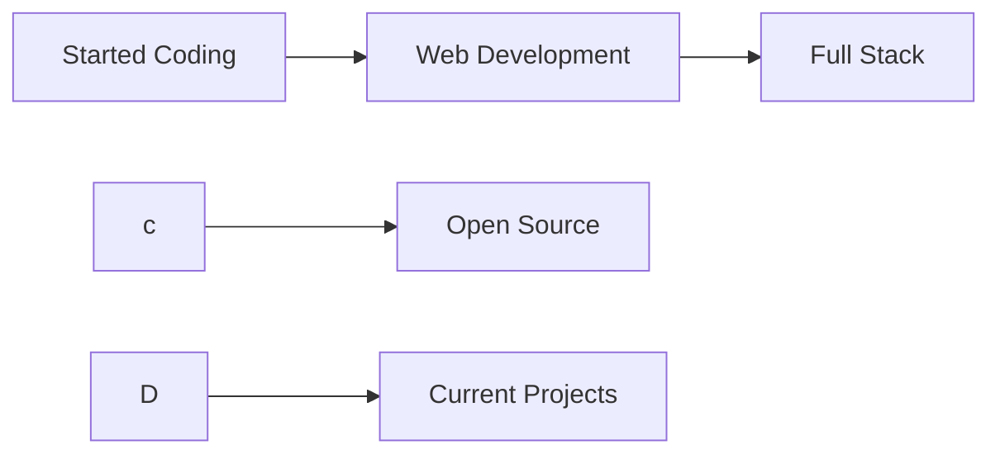
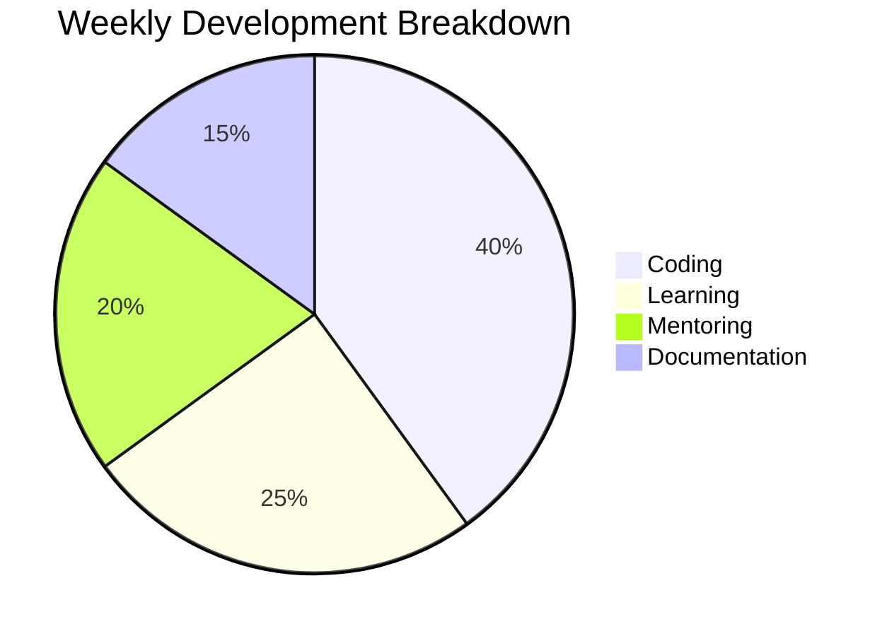
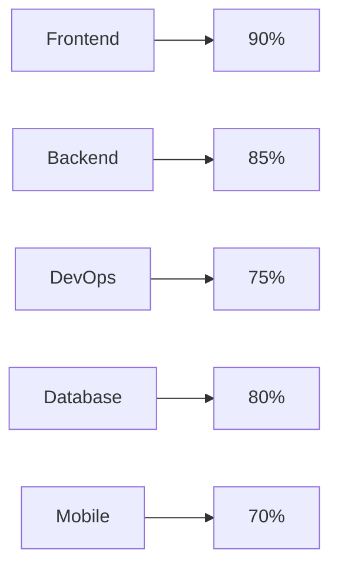

# EMTIAZ AHMED 👋

  
  
  
  
  
  

## 👨‍💻 About Me

I'm EMTIAZ AHMED, a passionate developer  in building computer programs and mentoring others in their development journey. I love creating innovative solutions and sharing knowledge with the community.

### 🎯 What I Do

- 💻 Full-stack Development
- 🤝 Mentoring & Teaching
- 🔧 Problem Solving
- 📚 Continuous Learning
- 🎨 UI/UX Design
- 📱 Mobile Development

### 🌱 My Journey

### 🎯 Goals for 2025

- [ ] Master Advanced React Patterns
- [ ] Contribute to 5 Open Source Projects
- [ ] Write 10 Technical Blog Posts
- [ ] Build 3 Full-Stack Applications

## 🛠️ Tech Stack

### 🎨 Frontend

  
  
  
  
  
  
  

### ⚙️ Backend

  
  
  
  
  

### 🛠️ Tools & Others

  
  
  
  
  
  

## 🌟 Featured Projects

### 🚀 Recent Projects

- 🔥 [Librant - Book Shop Application](https://github.com/Emtiaz-ahmed-13/Librant_client)

  - A full-stack e-commerce platform for buying books
  - Features:
    - Secure authentication with JWT
    - Role-based access (admin/user)
    - Product management and filtering
    - Payment integration with SurjoPay
    - Responsive design with Tailwind CSS
    - Real-time order tracking
    - User dashboard with order history
    - Admin dashboard for product management
    - Search and filter functionality
    - Shopping cart management
  - Tech Stack:
    - Frontend: React.js, TypeScript, Tailwind CSS, Ant Design
    - Backend: Node.js, Express.js, MongoDB
    - State Management: Redux Toolkit
    - Authentication: JWT
    - Payment: SurjoPay
    - Deployment: Vercel
  - Technical Implementation:
    - Implemented JWT authentication with refresh token rotation
    - Built role-based middleware for admin/user access control
    - Created real-time order tracking using WebSocket
    - Developed responsive UI components with Tailwind CSS
    - Integrated SurjoPay payment gateway with webhook handling
    - Implemented efficient MongoDB queries with proper indexing
  - Development Challenges & Solutions:
    - Challenge: Real-time order updates
      Solution: Implemented WebSocket for instant updates
    - Challenge: Payment integration
      Solution: Created robust error handling and retry mechanism
    - Challenge: Performance optimization
      Solution: Implemented caching and lazy loading
  - [Live Demo](https://librant-client-tr2p.vercel.app) | [Frontend](https://github.com/Emtiaz-ahmed-13/Librant_client) | [Backend](https://github.com/Emtiaz-ahmed-13/Librant_server)

- 📁 [FileDock - File Storage Application](https://github.com/Emtiaz-ahmed-13/filedock)

  - A modern file storage and management application
  - Features:
    - Secure user authentication with Clerk
    - File uploads with ImageKit integration
    - File management (star, trash, organize)
    - Responsive UI with HeroUI components
    - Real-time file operations
    - File sharing capabilities
  - Tech Stack:
    - Frontend: Next.js, TypeScript, Tailwind CSS
    - Authentication: Clerk
    - Database: Neon (PostgreSQL)
    - ORM: Drizzle
    - File Storage: ImageKit
    - UI: HeroUI
  - Technical Implementation:
    - Built with Next.js 14 App Router
    - Implemented server-side rendering for better performance
    - Created custom hooks for file operations
    - Developed efficient database queries with Drizzle ORM
    - Integrated Clerk for secure authentication
    - Implemented file upload with progress tracking
  - Development Challenges & Solutions:
    - Challenge: File upload optimization
      Solution: Implemented chunked uploads and progress tracking
    - Challenge: Database performance
      Solution: Used Drizzle ORM with proper indexing
    - Challenge: Authentication flow
      Solution: Integrated Clerk for secure and reliable auth
  - [GitHub Repository](https://github.com/Emtiaz-ahmed-13/filedock)

- 🎮 [Project 3] - A Online shoping platform

  - Features:create shop, sell your products
  - Tech: nextjs,mongodb,react,redux
  - [Live Demo](https://mart-client-rho.vercel.app/) | [GitHub](https://github.com/Emtiaz-ahmed-13/mart_client)

## 📊 GitHub Stats

  
  

  

## 📫 Currently Working On

- 🔧 Building a new web application with modern tech stack
- 📚 Learning new technologies and frameworks
- 🤝 Contributing to open-source projects
- 🎨 Designing new UI/UX components
- 📱 Developing mobile applications
- 📝 Writing technical blog posts
- 🎓 Completing advanced certifications

## 📈 Weekly Development Breakdown

## 🎯 Skills Progress

## 🤝 Connect With Me

  
  
  
  
  
  

---

  

  

  

  

