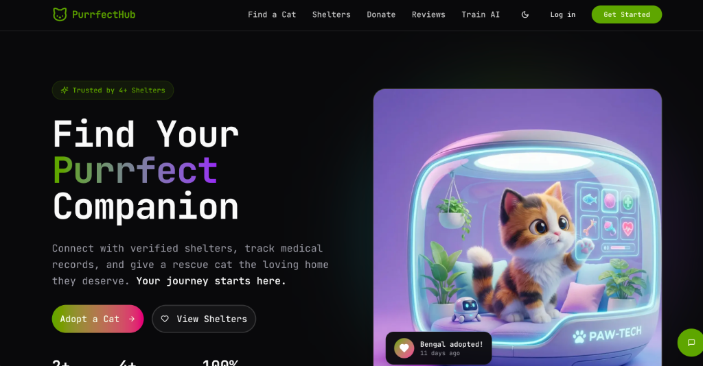
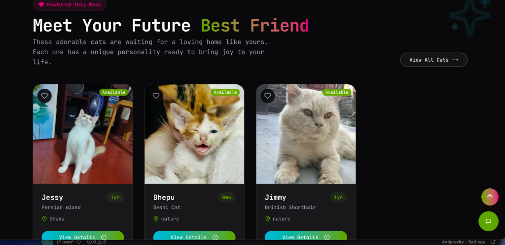
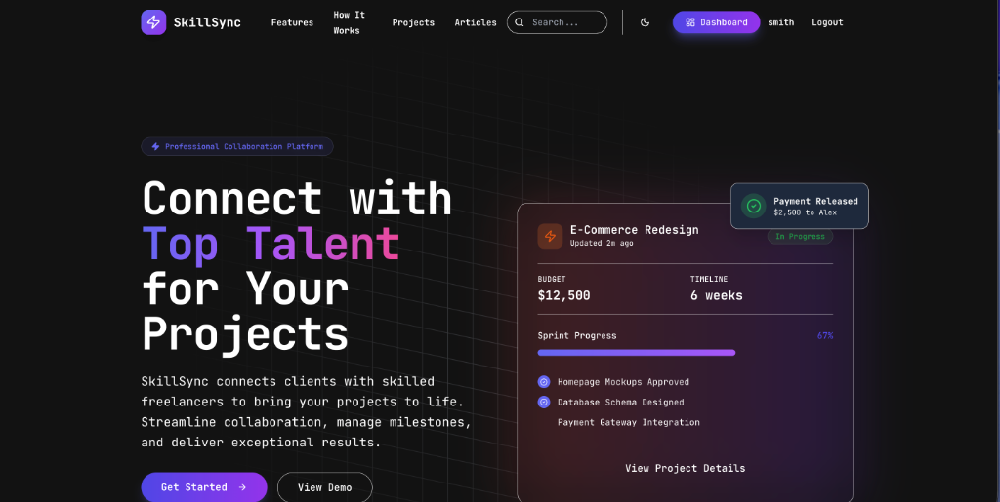
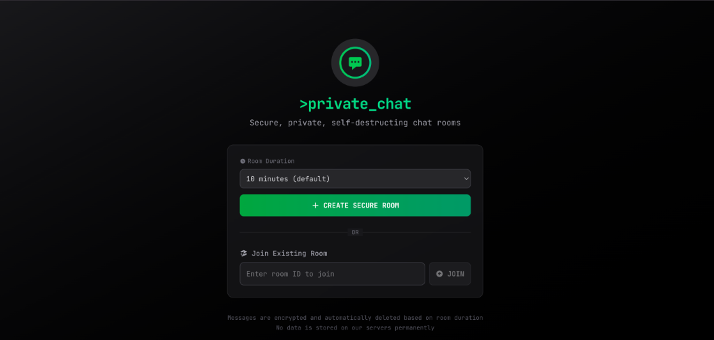

<div align="center">


<p align="center">
  
</p>

<h3>Software Engineer | React & Next.js Specialist | Problem Solver</h3>

<p>
  Building scalable web applications with modern technologies.<br>
  Merging clean code with efficient algorithms.
</p>

<p align="center">
  <a href="https://github.com/Emtiaz-ahmed-13?tab=followers">
    
  </a>
  <a href="https://github.com/Emtiaz-ahmed-13">
    
  </a>
  <a href="https://github.com/Emtiaz-ahmed-13?tab=repositories">
    
  </a>
</p>

<h3 align="center">📬 Contact & Availability</h3>

<div align="center">

🟢 **Open to Work** | 🌍 **Time Zone:** GMT+6 (Dhaka, Bangladesh)

[](https://linkedin.com/in/emtiaz-ahmed-2892871a2/)
[](mailto:emtiaz2060@gmail.com)
[](Emtiaz_Ahmed.pdf)
[](https://www.emtiaz-ahmed.site/)
[](https://www.facebook.com/errorprogrammer11)

**Preferred Contact:** 📧 Email | 💼 LinkedIn  
**Response Time:** Usually within 24 hours

</div>

---

<h3 align="center">👨‍💻 About Me</h3>

<div align="left">

I'm a **passionate Full Stack Developer** with expertise in building scalable, production-ready web applications using modern technologies. With a strong foundation in **competitive programming** and **problem-solving**, I bring algorithmic thinking to real-world software development challenges.

#### 💼 Professional Highlights

- 🎯 **2+ years** of hands-on experience in full-stack development
- 🏗️ Built **5+ production-grade applications** serving real users
- 🚀 Specialized in **Next.js, React, Node.js, TypeScript, and PostgreSQL**
- 🤖 Integrated **AI/ML features** (Gemini AI) into web applications
- 💳 Implemented **payment systems** (Stripe) and **real-time features** (Socket.io)
- 📊 Strong background in **Data Structures & Algorithms** (240+ day LeetCode streak)

#### 🎓 What I Do

- 🔭 Currently working on **Full Stack Web Development** with focus on scalable architectures
- 🌱 Learning **Advanced System Design, Cloud Architecture & DevOps**
- 👯 Open to collaborate on **Open Source Projects** and **Innovative Startups**
- 💬 Ask me about **React, Next.js, Node.js, TypeScript, Prisma, and Competitive Programming**

#### 🎯 Career Goals

Seeking opportunities as a **Software Engineer** where I can leverage my full-stack expertise to build impactful products, contribute to innovative teams, and continue growing as a developer.

</div>

---

<h3 align="center">🎓 Education</h3>

<div align="left">

<table>
<tr>
  <td width="120" align="center" valign="middle">
    
  </td>
  <td>
    <h4>Bachelor of Science in Computer Science</h4>
    <h3><a href="https://www.bracu.ac.bd/">BRAC University</a></h3>
    <span>📍 Dhaka, Bangladesh</span><br>
    <span>📅 2022 - Present (Expected Graduation: 2026)</span>
    <br><br>
    <b>Relevant Coursework:</b>
    <ul>
      <li>Data Structures & Algorithms</li>
      <li>Database Management Systems</li>
      <li>Software Engineering</li>
      <li>Web Technologies</li>
      <li>Object-Oriented Programming</li>
    </ul>
  </td>
</tr>
</table>

</div>


<h3 align="center">📜 Certifications</h3>

<div align="left">

<table>
  <!-- Programming Hero -->
  <tr>
    <td width="120" align="center" valign="middle">
      
    </td>
    <td>
      <h4>Full Stack Web Development</h4>
      <h3>Programming Hero</h3>
      <span>📅 2024 | Validation ID: <b>P</b></span>
      <br><br>
      <i>Comprehensive MERN stack development certification covering TypeScript, Node.js, Express, React, and PostgreSQL.</i>
      <br><br>
      <details>
        <summary><b>📄 Show Certificate</b></summary>
        <br>
        
      </details>
    </td>
  </tr>

  <!-- HackerRank SQL -->
  <tr>
    <td width="120" align="center" valign="middle">
      
    </td>
    <td>
      <h4>SQL (Intermediate)</h4>
      <h3>HackerRank</h3>
      <span>📅 May 2025 | ID: <b>C7DD49D1DE56</b></span>
      <br><br>
      <i>Demonstrated advanced skills in SQL queries, joins, database design, and query performance optimization.</i>
      <br><br>
      <details>
        <summary><b>📄 Show Certificate</b></summary>
        <br>
        
      </details>
    </td>
  </tr>

  <!-- BRAC Programming Contest -->
  <tr>
    <td width="120" align="center" valign="middle">
      
    </td>
    <td>
      <h4>Bit Battles Programming Contest</h4>
      <h3>BRAC University Computer Club</h3>
      <span>📅 Aug 2026 | ID: <b>BUCC25BB0S4EQX</b></span>
      <br><br>
      <i>Intra-university competitive programming contest utilizing advanced algorithms and problem-solving strategies.</i>
      <br><br>
      <details>
        <summary><b>📄 Show Certificate</b></summary>
        <br>
        
      </details>
    </td>
  </tr>

  <!-- LeetCode -->
  <tr>
    <td width="120" align="center" valign="middle">
      
    </td>
    <td>
      <h4>Competitive Programming Streak</h4>
      <h3>LeetCode</h3>
      <span>🔥 <b>240+ Days Active</b></span>
      <br><br>
      <i>Consistent daily problem solving focusing on Data Structures and Algorithms optimization.</i>
      <br>
    </td>
  </tr>
</table>

</div>

---
---

<h3 align="center">🛠️ Tech Stack & Skills</h3>

<p align="center">
  <br>
  <br>
  <br>
  
</p>

<details>
<summary><b>💡 Skills Proficiency</b></summary>
<br>

**Frontend Development**
```
React.js          ████████████████████ 95%
Next.js           ███████████████████░ 90%
TypeScript        ██████████████████░░ 85%
Tailwind CSS      ████████████████████ 95%
```

**Backend Development**
```
Node.js           ███████████████████░ 90%
Express.js        ███████████████████░ 90%
PostgreSQL        █████████████████░░░ 80%
Prisma ORM        ██████████████████░░ 85%
```

**Tools & Technologies**
```
Git & GitHub      ████████████████████ 95%
Docker            ████████████░░░░░░░░ 60%
Vercel/Netlify    ███████████████████░ 90%
Socket.io         ██████████████████░░ 85%
```

**Problem Solving**
```
Data Structures   ███████████████████░ 90%
Algorithms        ██████████████████░░ 85%
System Design     ███████████████░░░░░ 70%
```

</details>

---

<h3 align="center">🏆 GitHub Achievements</h3>

<div align="center">
  
</div>

---

<h3 align="center">📊 GitHub Analytics</h3>

<div align="center">

#### Most Used Languages


<br><br>


</div>

<br>

<p align="center">
  <!-- Coding Platform Streaks -->
  
  
  
</p>

<br>

<h3 align="center">💻 LeetCode Stats</h3>

<div align="center">
  
</div>

<br>

<h3 align="center">📈 Contribution Activity</h3>

<div align="center">
  
</div>


---

<h3 align="center">🚀 Featured Projects</h3>

<div align="left">

#### 🐾 [PurrfectHub - Modern Cat Adoption Platform](https://github.com/Emtiaz-ahmed-13/purrfecthub)

**Problem:** Traditional animal shelters struggle with inefficient adoption processes, lack of real-time communication, and limited reach to potential adopters.

**Solution:** Built a comprehensive full-stack platform connecting homeless cats with loving families through modern technology.

**Key Features:**
- 🤖 **AI-Powered Assistant** - Gemini AI integration for 24/7 cat care advice
- 💬 **Real-time Chat** - Socket.io for instant shelter-adopter communication
- 💳 **Secure Donations** - Stripe payment integration for shelter support
- 📸 **Image CDN** - ImageKit integration for optimized image delivery
- 🏥 **Medical Records** - Complete vaccination and treatment tracking system
- 📧 **Email Notifications** - Automated alerts via Nodemailer

**Tech Stack:**  
      

**Impact:** Streamlined adoption workflow for shelters and adopters with role-based dashboards, reducing adoption processing time.

**Screenshots:**

<details>
<summary>Click to view screenshots</summary>


*Hero section with modern UI and cat adoption call-to-action*


*Featured cats available for adoption*

</details>

[🌐 Live Demo](https://purrfecthub-client.vercel.app/) • [📂 View Repository](https://github.com/Emtiaz-ahmed-13/purrfecthub) • [📖 Documentation](https://github.com/Emtiaz-ahmed-13/purrfecthub_client)

---

#### 🤝 [SkillSync - Professional Collaboration Platform](https://github.com/Emtiaz-ahmed-13/skillsync)

**Problem:** Freelancers and clients need a unified platform for project management, communication, and secure payments.

**Solution:** Developed a comprehensive collaboration platform connecting freelancers with clients for seamless project execution.

**Key Features:**
- 📊 **Project Management** - Kanban-style task boards with milestone tracking
- 💰 **Payment Integration** - Stripe-powered secure milestone-based payments
- 📁 **File Management** - ImageKit integration for project file uploads
- 🔔 **Real-time Notifications** - Event-based notification system
- ⏱️ **Time Tracking** - Built-in time tracking for freelancers
- ⭐ **Review System** - Client-freelancer rating and review platform
- 🔐 **Multi-Auth** - Email, Google, and GitHub OAuth integration

**Tech Stack:**  
    

**Impact:** Enables efficient project collaboration with role-based dashboards for clients, freelancers, and admins.

**Screenshots:**

<details>
<summary>Click to view screenshot</summary>


*Professional collaboration platform connecting freelancers with clients*

</details>

[🌐 Live Demo](https://skillsync-client.vercel.app/) • [📂 View Repository](https://github.com/Emtiaz-ahmed-13/skillsync) • [📖 Documentation](https://github.com/Emtiaz-ahmed-13/skillsync_client)

---

#### 🔐 [Nebula Chat - Secure Self-Destructing Messaging](https://github.com/Emtiaz-ahmed-13/nebula)

**Problem:** Users need a privacy-focused platform for confidential conversations without permanent data storage.

**Solution:** Created a secure messaging platform with end-to-end encryption and automatic message destruction.

**Key Features:**
- 🔐 **End-to-End Encryption** - All messages encrypted for maximum privacy
- ⏰ **Self-Destructing Messages** - Auto-delete after configurable duration (5min - 1hr)
- 🚫 **No Permanent Storage** - Messages never stored permanently on servers
- 🌐 **Real-time Communication** - WebSocket-powered instant messaging
- 🔒 **Secure Rooms** - Private chat rooms with unique IDs
- 📱 **Fully Responsive** - Seamless experience across all devices

**Tech Stack:**  
    

**Impact:** Provides privacy-conscious users with secure, ephemeral communication channels.

**Screenshots:**

<details>
<summary>Click to view screenshot</summary>


*Secure, private, self-destructing chat rooms with end-to-end encryption*

</details>

[🌐 Live Demo](https://nebula-gamma-teal.vercel.app/) • [📂 View Repository](https://github.com/Emtiaz-ahmed-13/nebula) • [📖 Documentation](https://github.com/Emtiaz-ahmed-13/nebula#readme)

---

#### 🍔 [OrderEats - Food Ordering & Delivery Platform](https://github.com/Emtiaz-ahmed-13/ordereeats)

**Problem:** Restaurants need a modern online ordering system with real-time tracking.

**Solution:** Built a seamless food ordering application with real-time order tracking.

**Tech Stack:**  
  

[📂 View Repository](https://github.com/Emtiaz-ahmed-13/ordereeats)

</div>


---

<p align="center">
  
</p>

</div>
